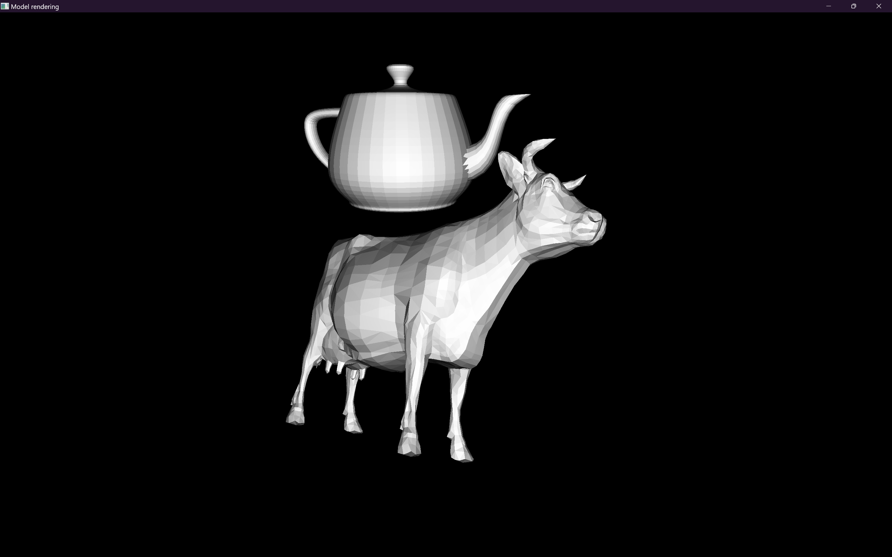

# Model Render engine

This is my attempt at making a 3D renderer.

It is coded entirely in C++, by me, with minimal libraries (so far i only use base language libraries and a 2D primitive drawing library)\
I also did my best to figure processes and maths myself\
That makes me feel pretty good about it but it might be slower than if i used libraries and exterior explanations and methods

If everything's going well, the program should be `renderer.exe` in the repository's root, and it should be statically linked (not dependant on any DLLs)

If for whatever reason you're looking for versions prior to 12/10/2024, look in my `stuff` repository, in the (past) folder `obj_render`

## Screenshots

The program currently looks like this :

## Support

The app supports `.obj` model files

Vertex coordinates are read correctly (currently ignoring optional 4th coordinate)\
Texture coordinates are read (correctly ?) but currently ignored due to lack of support of textures\
Normal vectors are read correctly but can be reinterpreted\
Face vertex indices are read correctly for only vertex coordinates, seizure warning if opening a model that has textures/normals\
Objects and groups inside models are ignored since there is currently no individual control over models\
Materials and textures are ignored, i would first have to implement a `.mtl` (material file) parser

The rendering is currently handled by the CPU, which makes it slow(er than GPU)

Primitive intersection is not handled, artifacts will arise

Do not expect fast loading of large models, i wrote the parser myself with only base C++ functionalities

## Control scheme

| Control | Action |
| ---: | :--- |
| `ZQSD` | camera movement |
| `IJKL / mouse drag` | camera orientation |
| `Ctrl + o` | open a new model |
| `Escape / Alt + F4` | close the program |
| `TFGH` | 1st model movement (debug, causes error if no models) |
| `CVBN` | 1st model orientation (debug, causes error if no models) |